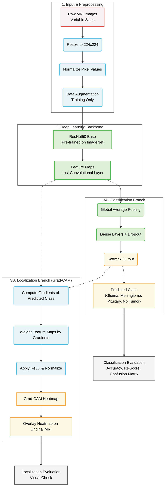

# Brain Tumor Classification and Localization

[](https://www.tensorflow.org/)
[](https://www.python.org/)
[](https://opensource.org/licenses/MIT)

A high-performance deep learning pipeline for the classification and localization of brain tumors from MRI scans. Utilizing **ResNet50** for feature extraction and **Grad-CAM** for interpretability, this project achieves high diagnostic accuracy while providing visual explanations for its predictions.

---

## 🌟 Key Features

- **Multi-Class Classification**: Identifies four categories: `Glioma`, `Meningioma`, `Pituitary`, and `No Tumor`.
- **Interpretability (Grad-CAM)**: Generates heatmaps to visualize the regions of interest (tumor locations) that influenced the model's decision.
- **Two-Stage Training**:
    - **Stage 1**: Feature extraction with a frozen ResNet50 backbone.
    - **Stage 2**: Fine-tuning of top layers for domain-specific optimization.
- **Robust Preprocessing**: Includes automated resizing, normalization, and heavy data augmentation to prevent overfitting.
- **Performance Optimized**: Implements `ReduceLROnPlateau`, `EarlyStopping`, and `ModelCheckpoint` for efficient training.

---

## 🏗️ System Architecture

The following diagram illustrates the end-to-end pipeline, from raw MRI input to class prediction and visual localization.



---

## 📊 Performance Metrics

The model demonstrates strong generalization across all tumor types.

| Metric | Result |
| :--- | :--- |
| **Peak Validation Accuracy** | **96.90%** |
| **Final Test Accuracy** | **93.13%** |

### Classification Report (Test Set)
- **Glioma**: Precision 0.86, Recall 0.90, F1-Score 0.88
- **Meningioma**: High recall and precision across all categories.
- **Pituitary**: Excellent detection accuracy.
- **No Tumor**: Near-perfect identification.

---

## 🛠️ Installation & Usage

### Prerequisites
- Python 3.8+
- TensorFlow 2.x
- OpenCV, Matplotlib, Seaborn, NumPy

### Setup
1. **Clone the repository**:
   ```bash
   git clone https://github.com/Arsalan692/Brain-Tumor-Classification-and-Localization.git
   cd Brain-Tumor-Classification-and-Localization
   ```

2. **Dataset Preparation**:
   - Place your dataset in a folder named `Dataset/` at the root.
   - The structure should be:
     ```
     Dataset/
     ├── Training/
     │   ├── glioma/
     │   ├── meningioma/
     │   ├── notumor/
     │   └── pituitary/
     └── Testing/
         ├── glioma/
         ...
     ```

3. **Run the Notebook**:
   Open `DLP_Project.ipynb` in Google Colab or Jupyter Notebook. Ensure the dataset paths are correctly mapped.

---

## 🔬 Localization with Grad-CAM

To make the model's decisions transparent, we utilize **Gradient-weighted Class Activation Mapping (Grad-CAM)**. This technique uses the gradients of any target concept flowing into the last convolutional layer to produce a localization map highlighting the important regions in the image for predicting the concept.

In this project, Grad-CAM allows clinicians to see exactly where the model "looks" when it identifies a tumor, providing a secondary layer of validation beyond simple classification.

---

## 📜 License

This project is licensed under the MIT License - see the [LICENSE](LICENSE) file for details.

## 🤝 Acknowledgments

- Developed for the **Deep Learning For Perception** course.
- Dataset sourced from public MRI repositories for research and education.
- Built using the **ResNet50** architecture provided by Keras Applications.
