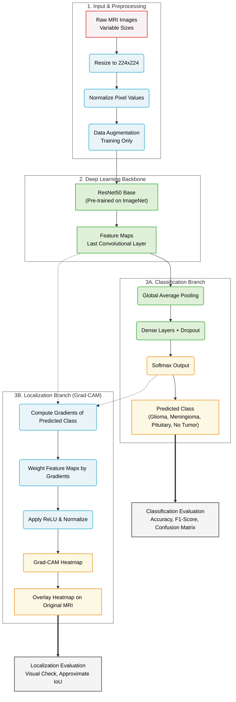

```mermaid
%%{init: {'theme': 'default', 'themeVariables': { 'darkMode': false, 'background': '#ffffff', 'primaryTextColor': '#000000', 'lineColor': '#333333', 'clusterBkg': '#ffffff', 'clusterBorder': '#666666'}}}%%
graph TD
    %% Styling for Light Mode
    classDef inputNode fill:#f9f2f4,stroke:#d9534f,stroke-width:2px,color:#000;
    classDef processNode fill:#e8f4f8,stroke:#5bc0de,stroke-width:2px,color:#000;
    classDef modelNode fill:#dff0d8,stroke:#5cb85c,stroke-width:2px,color:#000;
    classDef outputNode fill:#fcf8e3,stroke:#f0ad4e,stroke-width:2px,color:#000;
    classDef evalNode fill:#f4f4f4,stroke:#666666,stroke-width:2px,color:#000;

    subgraph "1. Input & Preprocessing"
        A[Raw MRI Images<br>Variable Sizes]:::inputNode --> B(Resize to 224x224):::processNode
        B --> C(Normalize Pixel Values):::processNode
        C --> D(Data Augmentation<br>Training Only):::processNode
    end

    subgraph "2. Deep Learning Backbone"
        D --> E["ResNet50 Base<br>(Pre-trained on ImageNet)"]:::modelNode
        E --> F[Feature Maps<br>Last Convolutional Layer]:::modelNode
    end

    subgraph "3A. Classification Branch"
        F --> G(Global Average Pooling):::modelNode
        G --> H(Dense Layers + Dropout):::modelNode
        H --> I(Softmax Output):::outputNode
        I --> J["Predicted Class<br>(Glioma, Meningioma, Pituitary, No Tumor)"]:::outputNode
    end

    subgraph "3B. Localization Branch (Grad-CAM)"
        F -.-> K(Compute Gradients of Predicted Class):::processNode
        I -.-> K
        K --> L(Weight Feature Maps by Gradients):::processNode
        L --> M(Apply ReLU & Normalize):::processNode
        M --> N[Grad-CAM Heatmap]:::outputNode
        N --> O[Overlay Heatmap on Original MRI]:::outputNode
    end

    %% Connections to Evaluation
    J ===> P[Classification Evaluation<br>Accuracy, F1-Score, Confusion Matrix]:::evalNode
    O ===> Q[Localization Evaluation<br>Visual Check, Approximate IoU]:::evalNode
```
